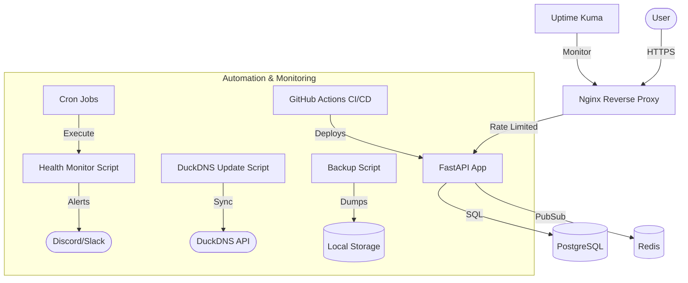

# StatusPulse 🚀

StatusPulse is a lightweight, high-performance status page and health monitoring API. It is designed as a "production-in-a-box" solution, featuring automated infrastructure, containerized deployment, proactive monitoring, and a secure networking stack.

## 🏗 Architecture Overview

The system is built with a focus on modularity and security:



## 🌟 Key Features

### 🐳 Containerization (Phase 1)
- **Multi-stage Builds**: Production images are optimized to be `<100MB`.
- **Security**: Containers run as non-root users to minimize attack surface.
- **Orchestration**: Full stack management with Docker Compose.

### 🔄 CI/CD Pipeline (Phase 2)
The project uses GitHub Actions for an automated, secure delivery pipeline:

#### 1. CI Pipeline (`ci.yml`)
Runs on every push or PR to `main`:
- **Linting**: Uses `ruff` for Python and `hadolint` for Dockerfile best practices.
- **Security Scanning**: Performs a `Trivy` scan on the built image to identify HIGH/CRITICAL vulnerabilities.
- **Integration Testing**: Starts the full stack (App + DB + Redis) via Docker Compose and runs a shell-based test suite (`tests/test_integration.sh`) to verify API endpoints.
- **Artifacts**: Uploads test logs as GitHub artifacts for debugging.

#### 2. CD Pipeline (`deploy.yml`)
Runs on push to `main` (after CI passes):
- **Build & Push**: Builds the production image and pushes it to **GitHub Container Registry (GHCR)** with tags for the commit `SHA` and `latest`.
- **Zero-Downtime Deploy**: SSHes into the EC2 instance and executes `scripts/deploy.sh`.
- **Health-Check Rollback**: If the new container fails its health check, the deployment script automatically rolls back to the previous stable version.
- **Notifications**: Sends status updates to Discord/Slack webhooks.

### 🌐 Live Deployment & Security (Phase 3 & 6)
- **Zero-Downtime**: Blue-green deployment strategy with health-check-based rollbacks.
- **Nginx Proxy**: Secured with rate limiting (100 req/min) and essential security headers.
- **Hardened OS**: Automatic SSH hardening, UFW firewall, and unattended security updates.

### 📊 Monitoring & Alerts (Phase 4)
- **Uptime Kuma**: Beautiful dashboard for external monitoring.
- **Custom Monitoring**: Shell script monitoring disk, memory, and container health.
- **Instant Alerts**: Webhook integration for real-time notifications.

### 🏗 Infrastructure as Code (Phase 5)
- **Modular Terraform**: AWS resources organized into VPC, Security Group, and EC2 modules.
- **Elastic IP**: Static public IP to ensure DNS persistence.
- **Termination Protection**: Guardrails against accidental infrastructure deletion.

---

## 🚀 Getting Started

### Prerequisites
- Docker & Docker Compose
- AWS CLI (for Terraform)
- A DuckDNS account (Token & Domain)

### 1. Local Development
Quickly start the stack for local testing:
```bash
cp .env.example .env
make build
make up
# Access the API Docs at http://localhost:8000/docs
```
*Note: For local TLS testing, the PDF recommends using `mkcert` to generate valid local certificates.*

### 2. Infrastructure Deployment
Navigate to the `terraform/` directory and follow the instructions to provision your AWS environment.

### 3. Server Setup
Once your server is up:
1. SSH into the instance.
2. Run `scripts/harden-server.sh`.
3. Configure your crontab for backups, DNS updates, and monitoring.

---

## 📁 Repository Structure
```text
.
├── .github/workflows/    # CI/CD Pipelines (CI, Deploy)
├── app/                  # FastAPI Application code
├── nginx/                # Nginx configuration (Reverse Proxy)
├── scripts/              # Management & Automation scripts
├── terraform/            # Modular IaC (VPC, SG, EC2)
├── tests/                # Integration test scripts
├── .dockerignore         # Docker build exclusions
├── docker-compose.yml    # Full stack orchestration
├── Dockerfile            # Multi-stage production build
├── Makefile              # Helper commands for devs
└── SECURITY.md           # Security policies and documentation
```

## 📜 Documentation Index
- [Infrastructure Documentation](./terraform/README.md)
- [Application & API Documentation](./app/README.md)
- [Scripts & Maintenance Guide](./scripts/README.md)
- [Testing Guide](./tests/README.md)

## 🛠 Troubleshooting

### API Returns 502/504
- Check if the `statuspulse-app` container is running: `docker ps`.
- Verify Nginx can reach the app via the internal network.

### Database Connection Issues
- Ensure `DB_HOST` in `.env` is set to `postgres` (the service name in docker-compose).
- Check Postgres logs: `docker compose logs postgres`.

### Monitoring Alerts Not Sending
- Verify `ALERT_WEBHOOK_URL` is correctly set in your environment.
- Check the monitor logs: `tail -f /var/log/statuspulse-monitor.log`.

### DNS Not Updating
- Verify your DuckDNS token and domain in the `.env` file.
- Check `tail -f /var/log/statuspulse-dns.log`.

## ⚖️ License
Distributed under the MIT License.
