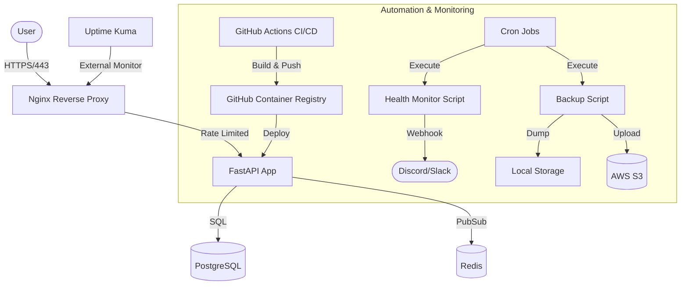

# StatusPulse 🚀

StatusPulse is a lightweight, high-performance status page and health monitoring API. Designed as a "production-in-a-box" solution, it features automated infrastructure, zero-downtime deployment, and proactive monitoring.

## 🏗 Architecture Overview

The system follows a **Hybrid Orchestration** model:
- **Docker Compose**: Manages persistent infrastructure (Postgres, Redis, Nginx, Uptime Kuma).
- **Custom Deploy Script**: Manages the application lifecycle via a **Blue-Green** strategy to ensure zero-downtime and automated rollbacks.



## 🌟 Key Features

### 🐳 Containerization & Orchestration
- **Multi-stage Builds**: Production images optimized for size and security.
- **Hybrid Strategy**: Combines the stability of Docker Compose with the flexibility of a custom Blue-Green deployment script.
- **Security**: Containers run as non-root users (`statuspulse`).

### 🔄 CI/CD Pipeline
- **Quality Gate**: Python linting (`ruff`) and Dockerfile linting (`hadolint`).
- **Security Scans**: Automated `Trivy` scans with documented vulnerability mitigation.
- **Automated Tests**: Full-stack integration tests run in the runner before deployment.
- **Auto-Deploy**: Continuous Deployment to EC2 via SSH and GHCR.

### 🌐 Live Deployment & Security
- **Zero-Downtime**: Health-check-based swap strategy with automatic rollback.
- **Hardened Nginx**: Rate limiting (100 req/min), SSL/TLS (Certbot), and strict security headers.
- **Hardened OS**: Automated SSH hardening and UFW firewall configuration.

### 📊 Monitoring & Alerts
- **Uptime Kuma**: External status dashboard.
- **Proactive Monitoring**: Custom shell scripts monitoring disk, memory, and container health.
- **Instant Alerts**: Webhook integration for real-time Discord/Slack notifications.

---

## 🚀 Getting Started

### 1. Local Development
```bash
cp .env.example .env
make build
make up
# Access API at http://localhost:8000/docs
```

### 2. Infrastructure Deployment
Navigate to `terraform/` to provision AWS resources (VPC, EC2, SG).

### 3. Server Setup
1. SSH into the instance.
2. Run `scripts/harden-server.sh`.
3. Configure crontab for backups, DNS, and monitoring.

---

## 📁 Repository Structure
```text
.
├── .github/workflows/    # CI/CD Pipelines (Test, Build, Deploy)
├── app/                  # FastAPI Application code
├── nginx/                # Nginx configuration (Reverse Proxy)
├── scripts/              # Management & Automation scripts
├── terraform/            # Modular IaC (VPC, SG, EC2)
├── tests/                # Integration test scripts
├── docker-compose.yml    # Infrastructure orchestration
├── Dockerfile            # Secure multi-stage build
└── SECURITY.md           # Security policies and CVE mitigations
```

## 📜 Documentation Index
- [Infrastructure (Terraform)](./terraform/README.md)
- [Application & API](./app/README.md)
- [Management Scripts](./scripts/README.md)
- [Testing Guide](./tests/README.md)

## ⚖️ License
Distributed under the MIT License.
